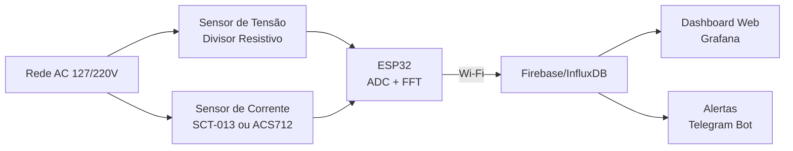
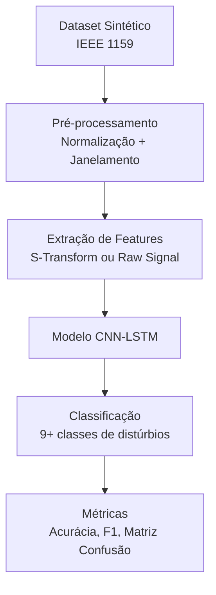
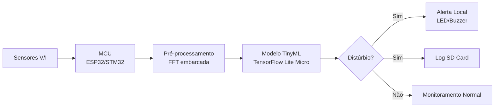
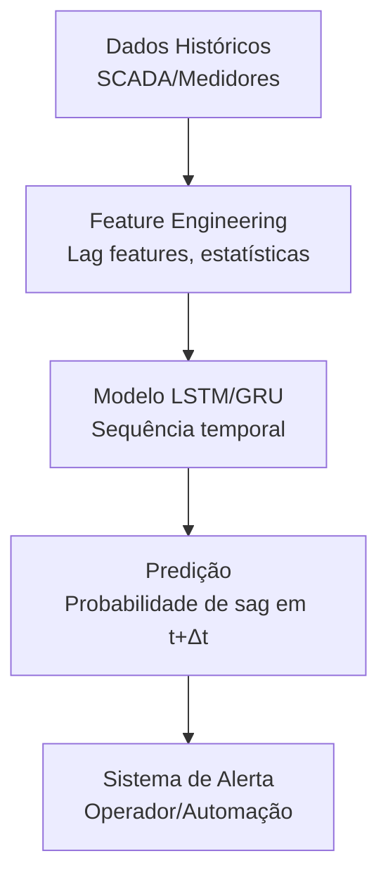
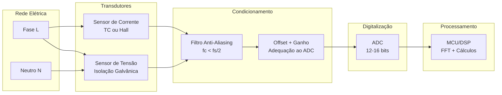
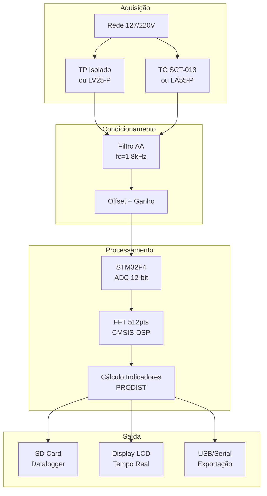
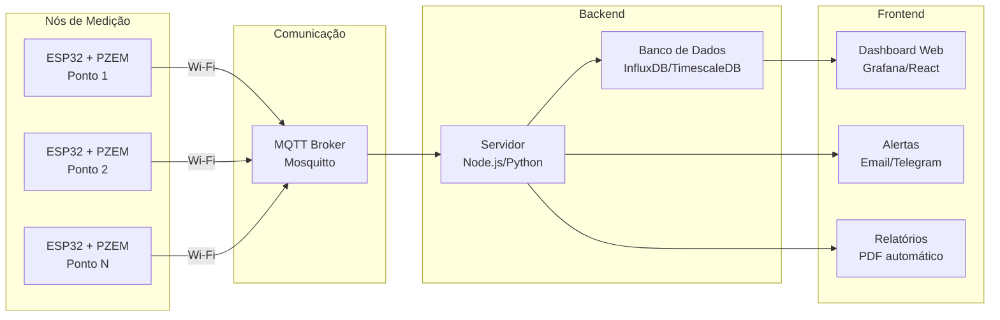
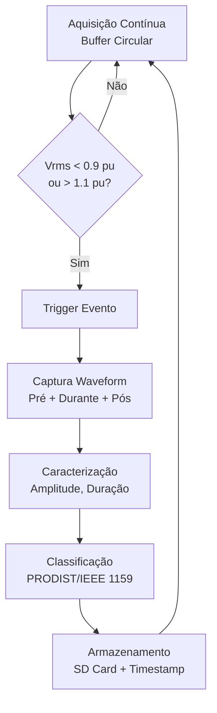
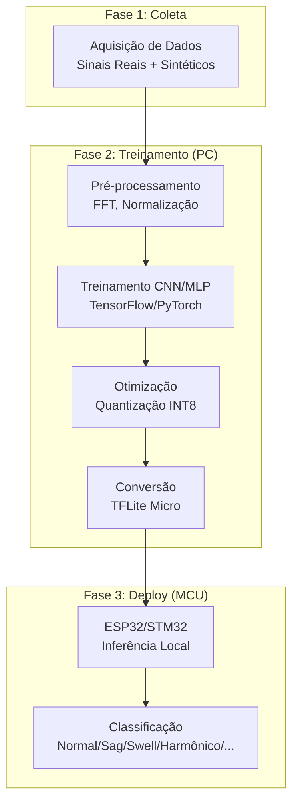

# Pesquisa Aprofundada: Qualidade de Energia Elétrica, Eletrônica Embarcada e Machine Learning

## Contexto

Este documento expande a revisão bibliográfica para o TCC, mapeando o estado da arte em três eixos: (1) sistemas embarcados para monitoramento de QEE, (2) aplicações de machine learning/deep learning em QEE, e (3) bases de dados disponíveis para pesquisa. Ao final, são apresentadas sugestões de projetos com arquiteturas simplificadas.

---

## 1. Sistemas Embarcados para Monitoramento de QEE

### 1.1 Abordagens com Microcontroladores de Baixo Custo

Diversos trabalhos acadêmicos demonstram a viabilidade de analisadores de QEE utilizando plataformas como Arduino, ESP32 e STM32. O TCC da UFCG (Santos, 2017) e o projeto da UFPR (Correa et al.) são exemplos nacionais que utilizam Arduino e ESP32 respectivamente, ambos com erros inferiores a 2% para medições de tensão, corrente, THD e fator de potência.

Internacionalmente, trabalhos recentes (2023-2024) exploram o ESP32 com sensores PZEM-004T para monitoramento IoT, integrando Firebase, InfluxDB e Grafana para visualização. O projeto open-source "rpi-power-monitor" ([GitHub](https://github.com/David00/rpi-power-monitor)) oferece uma solução completa com Raspberry Pi, ADC MCP3008 e até 6 sensores de corrente, com amostragem a cada 0.5s.

O STM32 aparece em trabalhos focados em processamento FFT de alta performance, utilizando a biblioteca CMSIS-DSP para cálculo de harmônicos em tempo real. A vantagem do STM32 sobre Arduino/ESP32 está na maior capacidade de processamento e ADCs mais precisos (12-16 bits).

### 1.2 Abordagens com FPGA

Para aplicações que exigem análise em frequências superiores (supraharmônicos, 2-150 kHz), FPGAs são preferidos. Trabalhos como "Design of a Supraharmonic Monitoring System Based on an FPGA" (MDPI Sensors, 2022) e "FPGA-based solution for real-time tracking of time-varying harmonics" demonstram implementações com sincronização GPS para rastreamento de distúrbios em múltiplos pontos da rede.

### 1.3 Comparativo de Plataformas

| Plataforma | Custo | ADC | Processamento FFT | Conectividade | Aplicação Típica |
|------------|-------|-----|-------------------|---------------|------------------|
| Arduino Uno | ~R$50 | 10-bit | Limitado (512 pts) | Serial/Shield | Didático, protótipos |
| ESP32 | ~R$40 | 12-bit | Bom (até 4096 pts) | Wi-Fi/BLE nativo | IoT, monitoramento remoto |
| STM32F4 | ~R$80 | 12-bit | Excelente (CMSIS-DSP) | Requer módulo | Alta precisão, tempo real |
| Raspberry Pi | ~R$300 | Externo | Muito bom (Python/C) | Wi-Fi/Ethernet | Análise avançada, ML local |
| FPGA | >R$500 | Externo | Paralelo, muito rápido | Requer módulo | Supraharmônicos, sincronização |

---

## 2. Machine Learning Aplicado à QEE

### 2.1 Classificação de Distúrbios de QEE

A classificação automática de distúrbios (sags, swells, harmônicos, flicker, transitórios) é a aplicação mais explorada. Técnicas tradicionais utilizam extração de características via Transformada de Fourier (FFT), Wavelet ou S-Transform, seguida de classificadores como SVM, Random Forest ou k-NN.

Trabalhos recentes (2022-2024) demonstram superioridade de abordagens deep learning:
- **CNN (Convolutional Neural Networks)**: Processam sinais 1D ou imagens espectrográficas (S-Transform), alcançando >98% de acurácia em datasets sintéticos
- **LSTM (Long Short-Term Memory)**: Capturam dependências temporais, úteis para distúrbios com variação no tempo
- **CNN-LSTM híbridos**: Combinam extração espacial (CNN) e temporal (LSTM), reportando 98.66% de acurácia mesmo com ruído de 50dB
- **Autoencoders + RBF**: Redução de dimensionalidade seguida de classificação, com bons resultados em cenários com ruído

Referências-chave:
- "Deep Learning Algorithm for Automatic Classification of Power Quality Disturbances" (MDPI Applied Sciences, 2025)
- "An Improved Power Quality Disturbance Detection Using Deep Learning Approach" (Hindawi, 2022)
- "A Classification Method for Power-Quality Disturbances Using Hilbert–Huang Transform and LSTM" (Springer, 2020)

### 2.2 Estimação e Predição de Harmônicos

Redes neurais são aplicadas para estimar amplitude e fase de harmônicos em tempo real, substituindo ou complementando a FFT tradicional. O trabalho "Amplitude and phase estimations of power system harmonics using deep learning framework" (IET, 2020) demonstra estimação em janelas de 20ms, viabilizando aplicações em filtros ativos.

Para predição de distúrbios (voltage sags), modelos LSTM e CNN-LSTM são treinados com séries temporais históricas para antecipar eventos, permitindo ações preventivas em smart grids.

### 2.3 Controle de Filtros Ativos com Redes Neurais

Filtros ativos de potência (APF) utilizam redes neurais para:
- Identificação de correntes harmônicas de referência (substituindo algoritmos p-q ou SRF)
- Controle adaptativo do inversor (ADALINE, RBF, Fuzzy-Neural)
- Compensação em tempo real com resposta dinâmica superior

O trabalho "Applications of Adaptive Long Short-Term Memory to Active Filtering" (Springer, 2021) propõe LSTM para compensação shunt, demonstrando melhoria na resposta a variações de carga.

### 2.4 TinyML e Edge AI para QEE

Uma fronteira emergente é a execução de modelos ML diretamente em microcontroladores (TinyML), eliminando a necessidade de conexão com servidores. Técnicas de quantização (INT8), pruning e knowledge distillation permitem comprimir modelos para <256KB de memória, com consumo <1mW.

Aplicações potenciais:
- Detecção de anomalias on-device em medidores inteligentes
- Classificação de distúrbios em tempo real sem latência de rede
- Manutenção preditiva em equipamentos industriais

---

## 3. Bases de Dados para Pesquisa

### 3.1 Datasets Sintéticos

| Dataset | Descrição | Distúrbios | Acesso |
|---------|-----------|------------|--------|
| IEEE DataPort - PQD Waveform 1D | Sinais sintéticos conforme IEEE 1159-2019 | Sag, swell, flicker, harmônicos, transitórios | [Link](https://ieee-dataport.org/documents/power-quality-disturbance-waveform-1d-data-and-model) |
| Stockwell Transform Features | 8 características extraídas de 9 classes de distúrbios | Normal, sag, swell, interrupção, transitório, harmônicos, combinados | [Link](https://ieee-dataport.org/documents/synthetic-data-paper-quantification-feature-importance-automatic-classification-power) |
| MATLAB PQD Generator | Scripts para geração parametrizada de distúrbios | Configurável | Disponível em repositórios acadêmicos |

### 3.2 Datasets Reais

| Dataset | Descrição | Aplicação | Acesso |
|---------|-----------|-----------|--------|
| Real-life Power Quality Sags | Eventos reais de afundamento conforme IEC 61000-4-11 | Validação de instrumentos | [IEEE DataPort](https://ieee-dataport.org/documents/real-life-power-quality-sags) |
| Three-Phase Time-Series | Tensão, corrente e potência trifásica com alta resolução temporal | Análise de estabilidade, compensação reativa | [IEEE DataPort](https://ieee-dataport.org/documents/time-series-dataset-three-phase-voltage-current-and-power-parameters-power-quality) |
| SIDED (Synthetic Industrial) | Dados de desagregação energética industrial via digital twin | NILM, eficiência energética | [EmergentMind](https://www.emergentmind.com/topics/synthetic-industrial-dataset-for-energy-disaggregation-sided) |

### 3.3 Benchmarks de Sistemas de Potência

Para simulações de rede, os sistemas IEEE 14, 57 e 118 barras possuem datasets de carga sintética com perfis sazonais e correlações regionais, úteis para estudos de fluxo de potência e integração de renováveis.

---

## 4. Sugestões de Projetos

### 4.1 Projeto A: Analisador de QEE com ESP32 e Dashboard Web

**Escopo**: Sistema embarcado para monitoramento de tensão, corrente, THD, fator de potência e frequência, com visualização em tempo real via dashboard web.

**Diferencial**: Integração com banco de dados em nuvem (Firebase/InfluxDB) e alertas automáticos via Telegram/WhatsApp.

**Arquitetura Simplificada**:



**Referências de apoio**:
- Projeto UFPR (Correa et al.) - Arquitetura similar com Android
- [rpi-power-monitor](https://github.com/David00/rpi-power-monitor) - Implementação open-source
- [CircuitDigest ESP32 Energy Monitor](https://circuitdigest.com/microcontroller-projects/diy-real-time-energy-monitoring-device-using-esp32)

**Complexidade**: Média | **Custo estimado**: R$150-250

---

### 4.2 Projeto B: Classificador de Distúrbios de QEE com Deep Learning

**Escopo**: Desenvolvimento e treinamento de modelo CNN ou CNN-LSTM para classificação automática de distúrbios de QEE a partir de sinais de tensão.

**Diferencial**: Comparação de múltiplas arquiteturas (CNN, LSTM, híbrido) e análise de robustez a ruído.

**Arquitetura Simplificada**:



**Datasets recomendados**:
- IEEE DataPort - PQD Waveform 1D
- Geração própria via MATLAB/Python seguindo IEEE 1159-2019

**Referências de apoio**:
- "Deep Learning Based a New Approach for Power Quality Disturbances Classification" (Springer, 2022)
- "A comprehensive research of machine learning algorithms for power quality disturbances classifier" (Springer, 2024)

**Complexidade**: Média-Alta | **Requisitos**: Python, TensorFlow/PyTorch, conhecimento básico de DL

---

### 4.3 Projeto C: Sistema Embarcado com TinyML para Detecção de Anomalias

**Escopo**: Implementação de modelo de ML compacto em ESP32 ou STM32 para detecção de distúrbios de QEE diretamente no dispositivo (edge inference).

**Diferencial**: Inferência local sem dependência de nuvem, baixa latência, aplicável a medidores inteligentes.

**Arquitetura Simplificada**:



**Ferramentas**:
- TensorFlow Lite for Microcontrollers
- Edge Impulse (plataforma de desenvolvimento TinyML)
- STM32Cube.AI

**Referências de apoio**:
- "TinyML for Ubiquitous Edge AI" (ResearchGate, 2020)
- [Edge Impulse Documentation](https://docs.edgeimpulse.com/)

**Complexidade**: Alta | **Requisitos**: Conhecimento de ML, programação embarcada, otimização de modelos

---

### 4.4 Projeto D: Predição de Afundamentos de Tensão com LSTM

**Escopo**: Modelo de predição de voltage sags utilizando séries temporais históricas, permitindo ações preventivas em sistemas de distribuição.

**Diferencial**: Aplicação de deep learning para previsão (não apenas classificação), com potencial para integração em sistemas SCADA.

**Arquitetura Simplificada**:



**Datasets recomendados**:
- Real-life Power Quality Sags (IEEE DataPort)
- Dados simulados de sistemas IEEE com injeção de faltas

**Referências de apoio**:
- "SCNGO-CNN-LSTM-Based Voltage Sag Prediction Method" (MDPI Energies, 2025)
- "A Predictive Model Using LSTM for Power System Voltage Stability" (MDPI Applied Sciences, 2024)

**Complexidade**: Alta | **Requisitos**: Python, séries temporais, conhecimento de redes elétricas

---

### 4.5 Projeto E: Controle de Filtro Ativo com Rede Neural

**Escopo**: Implementação de algoritmo de identificação de harmônicos baseado em rede neural (ADALINE ou MLP) para controle de filtro ativo de potência em simulação.

**Diferencial**: Comparação com métodos tradicionais (p-q, SRF) em termos de THD resultante e resposta dinâmica.

**Arquitetura Simplificada**:


**Ferramentas**:
- MATLAB/Simulink com Simscape Electrical
- PSIM ou PLECS

**Referências de apoio**:
- "Active Power Filter Design Using Neural Network with a Variable Step-Size" (UTEC, 2023)
- "Nonlinear Loads Compensation Using a Shunt Active Power Filter Controlled by Feedforward Neural Networks" (MDPI, 2021)

**Complexidade**: Média-Alta | **Requisitos**: Simulação de eletrônica de potência, redes neurais básicas

---

## 5. Referências Bibliográficas Complementares

### Normas e Padrões
- IEEE Std 519-2014: Harmonic Control in Electric Power Systems
- IEEE Std 1159-2019: Monitoring Electric Power Quality
- IEC 61000-4-30: Power Quality Measurement Methods
- IEC 61000-4-7: Harmonics and Interharmonics Measurements
- PRODIST Módulo 8 (ANEEL)
- ONS Submódulo 9.7

### Artigos e Trabalhos Acadêmicos
1. Correa, R.; Molinari, C.; Lolis, L. "Sistema Embarcado Analisador de QEE com Interface Android". UFPR/GICS.
2. Santos, A. G. "Projeto de um Analisador da QEE Monofásico de Baixo Custo". UFCG, 2017.
3. Hoevenaars, A. "Uma Forma Prática de Aplicar os Limites de Harmônicos da IEEE 519-2014". Mirus/STULZ.
4. "Deep Learning Algorithm for Automatic Classification of PQD". MDPI Applied Sciences, 2025.
5. "A comprehensive research of ML algorithms for PQD classifier". Springer, 2024.
6. "Applications of Adaptive LSTM to Active Filtering". Springer, 2021.
7. "TinyML for Ubiquitous Edge AI". ResearchGate, 2020.
8. "Design of a Supraharmonic Monitoring System Based on FPGA". MDPI Sensors, 2022.

### Repositórios e Recursos Online
- [rpi-power-monitor](https://github.com/David00/rpi-power-monitor) - Monitor de potência open-source
- [Open Energy Monitor](https://github.com/openenergymonitor/emonpi) - Plataforma de monitoramento energético
- [IEEE DataPort](https://ieee-dataport.org/) - Datasets de QEE
- [Edge Impulse](https://www.edgeimpulse.com/) - Plataforma TinyML
- [TensorFlow Lite Micro](https://www.tensorflow.org/lite/microcontrollers) - ML em microcontroladores

---

## 6. Considerações para Escolha do Projeto

| Critério | Projeto A | Projeto B | Projeto C | Projeto D | Projeto E |
|----------|-----------|-----------|-----------|-----------|-----------|
| Hardware necessário | ESP32 + sensores | Computador | ESP32/STM32 | Computador | Computador (simulação) |
| Foco principal | Eletrônica + IoT | Machine Learning | Embarcado + ML | Machine Learning | Eletrônica de Potência |
| Complexidade | Média | Média-Alta | Alta | Alta | Média-Alta |
| Custo | R$150-250 | Baixo | R$100-200 | Baixo | Baixo |
| Originalidade | Moderada | Moderada | Alta | Alta | Moderada |
| Aplicabilidade prática | Alta | Média | Alta | Média | Média |

A escolha deve considerar seu interesse pessoal, recursos disponíveis e orientação do professor. Projetos que combinam hardware e software (A, C) tendem a ser mais completos para engenharia elétrica, enquanto projetos focados em ML (B, D) podem ser mais adequados se houver interesse em ciência de dados aplicada.


---

# PARTE II: Implementação de Sistema Autônomo de Análise de QEE

Esta seção aprofunda os aspectos técnicos para construção de um sistema de aquisição e análise de qualidade de energia conforme PRODIST e normas internacionais.

---

## 7. Requisitos Normativos para Medição de QEE

### 7.1 Classes de Desempenho (IEC 61000-4-30)

A norma IEC 61000-4-30 define três classes de instrumentos de medição:

| Classe | Aplicação | Precisão | Uso Típico |
|--------|-----------|----------|------------|
| **Classe A** | Medições contratuais, verificação de conformidade | Máxima (±0.1% tensão) | Concessionárias, auditorias, disputas legais |
| **Classe S** | Pesquisas estatísticas, monitoramento | Intermediária | Estudos de rede, diagnósticos |
| **Classe B** | Indicativo (descontinuada) | Menor | Uso didático |

Para um TCC, a **Classe S** é um objetivo realista, enquanto Classe A exige calibração certificada e componentes de alta precisão.

### 7.2 Parâmetros e Intervalos de Agregação

Conforme PRODIST Módulo 8 e IEC 61000-4-30:

| Parâmetro | Intervalo de Medição | Agregação | Observação |
|-----------|---------------------|-----------|------------|
| Tensão RMS | 10 ciclos (200ms @50Hz) | 10min, 2h | Valor eficaz a cada 10 ciclos |
| Frequência | 10s | 10s | Desvio da nominal (60Hz) |
| THD/Harmônicos | 200ms (12 ciclos @60Hz) | 10min | Até 50ª ordem (3kHz @60Hz) |
| Flicker (Pst) | 10min | 10min | Algoritmo IEC 61000-4-15 |
| Flicker (Plt) | 2h | 2h | Média cúbica de 12 valores Pst |
| Desequilíbrio | 10 ciclos | 10min | Razão V-/V+ |
| VTCD | Evento | Evento | Detecção por limiar (0.9/1.1 pu) |

### 7.3 Taxa de Amostragem Mínima

Para análise de harmônicos até a 50ª ordem (3000 Hz @60Hz), pelo critério de Nyquist:
- **Mínimo teórico**: 6000 Hz (2 × 3000 Hz)
- **Recomendado**: 12.8 kHz (256 amostras/ciclo) ou superior
- **Classe A**: Tipicamente 10.24 kHz a 40.96 kHz

Para sistemas embarcados de baixo custo, 3840 Hz (64 amostras/ciclo) permite análise até a 30ª harmônica com margem adequada.

---

## 8. Cadeia de Aquisição de Sinais

### 8.1 Arquitetura Geral



### 8.2 Sensores de Tensão

#### Opção 1: Divisor Resistivo (Baixo Custo, SEM Isolação)

**Vantagens**: Simples, barato, resposta em frequência plana
**Desvantagens**: Sem isolação galvânica (RISCO DE SEGURANÇA), dissipação de potência

```
Vin (220Vrms) ──┬── R1 (1MΩ) ──┬── Vout (para ADC)
                │              │
                └── R2 (1kΩ) ──┴── GND
                
Ganho: Vout/Vin = R2/(R1+R2) ≈ 1/1000
Vout_max = 220√2 / 1000 ≈ 0.31V (pico)
```

**CUIDADO**: Requer offset para ADCs unipolares e NÃO oferece isolação. Usar apenas em bancada com proteção adequada.

#### Opção 2: Transformador de Potencial (TP)

**Vantagens**: Isolação galvânica, segurança
**Desvantagens**: Resposta em frequência limitada, custo maior, não-linearidade em harmônicos

Transformadores de tensão para medição (classe 0.5 ou melhor) são preferidos para aplicações que exigem segurança.

#### Opção 3: Transdutores de Tensão com Isolação (LV25-P, ACPL-C87x)

**Vantagens**: Isolação galvânica, linearidade, resposta em frequência adequada
**Desvantagens**: Custo intermediário

O LV25-P (LEM) é amplamente usado em projetos acadêmicos, oferecendo isolação de 2.5kV e linearidade de 0.2%.

### 8.3 Sensores de Corrente

| Sensor | Tipo | Faixa | Precisão | Isolação | Custo | Aplicação |
|--------|------|-------|----------|----------|-------|-----------|
| **SCT-013-000** | TC split-core | 0-100A | ~3% | Sim | ~R$30 | Monitoramento não-invasivo |
| **SCT-013-030** | TC com saída em tensão | 0-30A | ~3% | Sim | ~R$35 | Conexão direta ao ADC |
| **ACS712-20A** | Efeito Hall | ±20A | ~1.5% | Sim | ~R$15 | Correntes menores, invasivo |
| **ACS758** | Efeito Hall | ±50A a ±200A | ~1% | Sim | ~R$50 | Correntes maiores |
| **LA55-P** | Efeito Hall (LEM) | ±50A | 0.65% | Sim | ~R$150 | Alta precisão |
| **Shunt** | Resistivo | Variável | <0.5% | Não | ~R$20 | Máxima precisão, sem isolação |

**Recomendação para TCC**: SCT-013 para aplicações não-invasivas ou ACS712/ACS758 para medições em linha.

### 8.4 Filtro Anti-Aliasing

Essencial para evitar rebatimento de frequências superiores à metade da taxa de amostragem.

**Especificação típica**:
- Tipo: Butterworth ou Bessel (2ª a 4ª ordem)
- Frequência de corte: fc ≤ 0.4 × fs (ex: fc = 1.5 kHz para fs = 3.84 kHz)
- Atenuação: ≥40 dB na frequência de Nyquist

**Implementação com filtro Sallen-Key (2ª ordem)**:

```
Vin ──┬── R1 ──┬── R2 ──┬──[+]─┐
      │        │        │      │ Op-Amp
      C1       │        C2     │
      │        │        │      ├── Vout
      GND      └────────┴──[-]─┘
                           │
                           └── (feedback)
```

Para fc = 1.8 kHz (30ª harmônica @60Hz):
- R1 = R2 = 10 kΩ
- C1 = C2 = 8.8 nF (usar 10 nF)

### 8.5 Condicionamento de Sinal

ADCs de microcontroladores tipicamente aceitam 0-3.3V. Sinais AC precisam de:

1. **Offset DC**: Adicionar tensão de referência (ex: 1.65V) para centralizar o sinal
2. **Ganho**: Ajustar amplitude para ocupar a faixa dinâmica do ADC

```
Sinal AC (-1V a +1V) + Offset (1.65V) = Sinal (0.65V a 2.65V)
```

**Circuito de offset com divisor resistivo**:
```
3.3V ──┬── R3 (10kΩ) ──┬── Vref (1.65V)
       │               │
       └── R4 (10kΩ) ──┴── GND
```

---

## 9. Processamento Digital de Sinais

### 9.1 Cálculo de Valor RMS

Para N amostras por ciclo:

```
Vrms = √(1/N × Σ(v[n]²))
```

**Implementação em C**:
```c
float calcRMS(float *samples, int N) {
    float sum = 0;
    for (int i = 0; i < N; i++) {
        sum += samples[i] * samples[i];
    }
    return sqrt(sum / N);
}
```

### 9.2 Transformada de Fourier (FFT)

A FFT permite decompor o sinal em componentes harmônicas. Para N = 512 amostras:

- Resolução em frequência: Δf = fs / N (ex: 3840/512 = 7.5 Hz)
- Harmônicas: bins correspondentes a 60Hz, 120Hz, 180Hz, ...

**Bibliotecas recomendadas**:
- **ESP32**: arduinoFFT, ESP-DSP
- **STM32**: CMSIS-DSP (arm_cfft_f32)
- **Raspberry Pi**: NumPy/SciPy (np.fft.fft)

### 9.3 Cálculo de THD

Conforme PRODIST:

```
THD% = √(Σ(Vh²)) / V1 × 100

Onde:
- V1 = amplitude da fundamental (60Hz)
- Vh = amplitude da h-ésima harmônica (h = 2, 3, ..., 50)
```

### 9.4 Cálculo de Fator de Potência

**Método 1 - Via defasagem (cargas lineares)**:
```
FP = cos(φ)
φ = ângulo entre V e I na fundamental
```

**Método 2 - Via potências (cargas não-lineares)**:
```
FP = P / S = P / √(P² + Q²)

Onde:
- P = potência ativa (média de v(t)×i(t))
- S = potência aparente (Vrms × Irms)
```

### 9.5 Algoritmo de Flickermeter (IEC 61000-4-15)

O flickermeter digital implementa 5 blocos:

1. **Bloco 1**: Normalização da tensão de entrada
2. **Bloco 2**: Demodulador quadrático (extrai envelope)
3. **Bloco 3**: Filtros passa-banda (simula resposta lâmpada-olho-cérebro)
4. **Bloco 4**: Detector de nível (média quadrática móvel)
5. **Bloco 5**: Análise estatística (cálculo de Pst)

**Referência de implementação**: MATLAB Simscape possui bloco "Digital Flickermeter" que pode servir de referência.

---

## 10. Módulos Integrados de Medição

### 10.1 PZEM-004T

Módulo popular para monitoramento de energia com comunicação serial (Modbus RTU).

| Parâmetro | Faixa | Precisão |
|-----------|-------|----------|
| Tensão | 80-260V AC | 0.5% |
| Corrente | 0-100A | 0.5% |
| Potência | 0-23kW | 0.5% |
| Energia | 0-9999.99kWh | 0.5% |
| Frequência | 45-65Hz | 0.5% |
| Fator de Potência | 0.00-1.00 | 1% |

**Limitações**: Não fornece formas de onda, THD ou harmônicos individuais. Útil para monitoramento básico, mas insuficiente para análise completa de QEE.

### 10.2 ADE7880 / ADE9000 (Analog Devices)

CIs dedicados para medição de energia com análise harmônica integrada.

**ADE9000**:
- 7 canais ADC sigma-delta (3V + 3I + 1 neutro)
- Análise harmônica até 63ª ordem
- Precisão <0.1% em energia
- Waveform buffer para captura de eventos
- Interface SPI

**Vantagens**: Processamento de QEE em hardware dedicado, alta precisão
**Desvantagens**: Custo (~US$15-20), complexidade de implementação, requer PCB customizada

---

## 11. Cuidados de Projeto e Segurança

### 11.1 Isolação Galvânica

**CRÍTICO**: Trabalhar com tensão de rede (127/220V) apresenta risco de choque elétrico fatal.

Requisitos mínimos:
- Isolação entre circuito de potência e circuito de baixa tensão
- Transformadores de isolação ou optoacopladores
- Gabinete com proteção IP adequada
- Fusíveis e proteção contra sobrecorrente

### 11.2 Aterramento e Referência

- O neutro da rede NÃO deve ser conectado diretamente ao GND do microcontrolador
- Usar transdutores isolados ou transformadores
- Manter separação física entre trilhas de alta e baixa tensão na PCB

### 11.3 Proteção de Entrada

- Diodos de clamping para proteção do ADC
- TVS (Transient Voltage Suppressor) para surtos
- Fusíveis ou PTC na entrada de medição

### 11.4 Calibração

Para resultados confiáveis:
1. Calibrar offset do ADC (leitura com entrada em curto)
2. Calibrar ganho com fonte de referência conhecida
3. Verificar linearidade em múltiplos pontos
4. Documentar procedimento e incertezas

---

## 12. Novas Sugestões de Projetos

### 12.1 Projeto F: Qualímetro Portátil Conforme PRODIST

**Escopo**: Sistema embarcado autônomo para medição de parâmetros de QEE conforme PRODIST Módulo 8, com armazenamento local e interface para análise posterior.

**Parâmetros medidos**:
- Tensão RMS e classificação (adequada/precária/crítica)
- THD de tensão e corrente
- Harmônicos individuais até 25ª ordem
- Fator de potência
- Frequência
- Indicadores DRP e DRC (calculados sobre período de medição)

**Arquitetura**:



**Diferencial**: Conformidade com norma brasileira, geração de relatório com classificação de tensão.

**Complexidade**: Alta | **Custo**: R$200-400

---

### 12.2 Projeto G: Sistema de Monitoramento Distribuído com Dashboard

**Escopo**: Múltiplos nós de medição (ESP32) enviando dados para servidor central, com dashboard web para visualização e geração de relatórios.

**Arquitetura**:



**Diferencial**: Escalabilidade, monitoramento de múltiplos pontos, análise comparativa.

**Complexidade**: Média-Alta | **Custo**: R$100-150 por nó

---

### 12.3 Projeto H: Analisador com Detecção Inteligente de Eventos (VTCD)

**Escopo**: Sistema focado na detecção e caracterização de Variações de Tensão de Curta Duração (afundamentos, elevações, interrupções) com registro de forma de onda.

**Funcionalidades**:
- Monitoramento contínuo de tensão RMS (10 ciclos)
- Detecção de eventos por limiar (0.9 pu e 1.1 pu)
- Captura de forma de onda pré e pós-evento (waveform capture)
- Classificação automática (AMT, EMT, ATT, ETT, IMT, ITT)
- Estatísticas de ocorrência (frequência, duração média)

**Arquitetura**:



**Diferencial**: Foco em eventos transitórios, útil para diagnóstico de problemas intermitentes.

**Complexidade**: Média-Alta | **Custo**: R$150-300

---

### 12.4 Projeto I: Plataforma de Análise com Machine Learning Embarcado

**Escopo**: Combinar aquisição de dados com modelo de ML embarcado para classificação automática de distúrbios e detecção de anomalias.

**Fluxo de desenvolvimento**:



**Diferencial**: Inteligência embarcada, detecção em tempo real sem conexão com nuvem.

**Complexidade**: Muito Alta | **Custo**: R$100-200 (hardware) + tempo de desenvolvimento

---

## 13. Ferramentas e Recursos Recomendados

### 13.1 Software de Desenvolvimento

| Ferramenta | Aplicação | Licença |
|------------|-----------|---------|
| **Arduino IDE / PlatformIO** | Programação ESP32/Arduino | Gratuito |
| **STM32CubeIDE** | Programação STM32 | Gratuito |
| **MATLAB/Simulink** | Simulação, processamento de sinais | Acadêmica |
| **Python + NumPy/SciPy** | Análise de dados, ML | Gratuito |
| **KiCad / EasyEDA** | Design de PCB | Gratuito |
| **Grafana** | Dashboard de visualização | Gratuito |
| **InfluxDB** | Banco de dados de séries temporais | Gratuito |

### 13.2 Bibliotecas Úteis

- **arduinoFFT**: FFT para Arduino/ESP32
- **CMSIS-DSP**: DSP otimizado para ARM Cortex-M
- **TensorFlow Lite Micro**: ML em microcontroladores
- **Modbus-ESP8266**: Comunicação com PZEM-004T
- **ESPAsyncWebServer**: Servidor web para ESP32

### 13.3 Referências de Implementação

- [Analog Devices - Power Quality Monitoring Design Guide](https://www.analog.com/en/resources/analog-dialogue/articles/power-quality-monitoring-part-2-design-considerations-for-power-quality-meter.html)
- [Open Energy Monitor](https://openenergymonitor.org/) - Projeto open-source completo
- [Power Quality Blog](https://powerquality.blog/) - Artigos técnicos sobre IEC 61000-4-30

---

## 14. Resumo: Matriz de Decisão para Projetos

| Projeto | Hardware | Software | Normas | ML | Complexidade | Recomendação |
|---------|----------|----------|--------|-----|--------------|--------------|
| **F - Qualímetro PRODIST** | STM32 + sensores | C/C++ embarcado | PRODIST, IEC | Não | Alta | Engenharia Elétrica tradicional |
| **G - Monitoramento Distribuído** | ESP32 + PZEM | IoT + Web | Básico | Não | Média-Alta | Foco em sistemas e IoT |
| **H - Detector de VTCD** | STM32/ESP32 | C/C++ embarcado | IEEE 1159 | Não | Média-Alta | Foco em eventos transitórios |
| **I - ML Embarcado** | ESP32/STM32 | Python + C | Variável | Sim | Muito Alta | Interesse em IA/ML |

A escolha final deve equilibrar seus interesses (eletrônica, programação, ML), recursos disponíveis (tempo, orçamento, equipamentos de laboratório) e alinhamento com a orientação do TCC.
